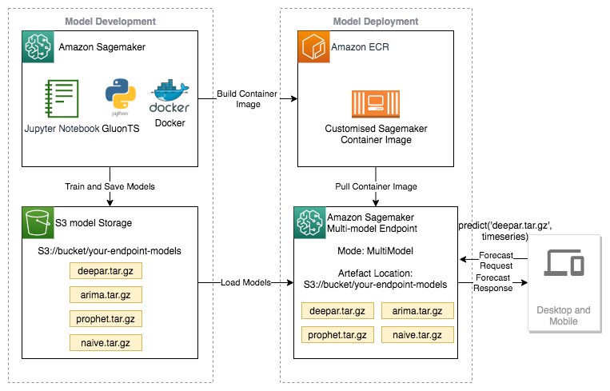

# SageMaker 커스텀 컨테이너와 GluonTS로 전력 수요 예측하기
Gluon TS 라이브러리를 사용하여 시계열 모델을 트레이닝하고 평가한 다음, SageMaker 커스텀 컨테이너를 사용하여 추론용 다중 모델 서버 SageMaker 엔드포인트를 배포하는 방법을 알아봅니다.

## 레벨
- 300 중급

## 데이터셋
- UC Irvine Machine Learning Repository - Individual household electric power consumption

## AWS 서비스
- Amazon SageMaker
- AWS ECR
- Gluon TS

## 아키텍쳐 다이어그램

## 시작하기
1. 아래 명령어를 이용하여 Conda 가상 환경을 구성합니다:

    ./build_env.sh

2. 아래 Jupyter 노트북들을 실행합니다. (conda_gluonts-multimodel 커널을 선택해 주세요).
    - 00_predict_electricity_demand_with_the_gluonts_library.ipynb
    - 01_deploy_gluonts_forecast_models_as_multi_model_endpoints.ipynb

## Outline
- 1. 소개
- 2. 문제 정의 
- 3. 아키텍쳐 디자인 
- 4. 데이터 준비 - 데이터 다운로드 및 pandas를 이용하여 다시 샘플링하기
- 5. 머신 러닝 모델들 
    - Mean model로 트레이닝/평가하기
    - seasonal naive model로 트레이닝/평가하기 Train/Evaluate the seasonal naive model
    - Exponential smoothing (ETS) model로 트레이닝/평가하기
    - Prophet model로 트레이닝/평가하기
    - DeepAR model로 트레이닝/평가하기
    - 모델들 비교하기
- 6. 배포를 위한 모델 아티팩트 준비
- 7. 모델 배포를 위한 SageMaker 커스텀 컨테이너 빌드하기
- 8. 모델들을 다중 모델 엔드포인트로 배포하고 호출하기 
- 9. 리소스 삭제
- 10. 결론

## License

본 라이브러리는 MIT-0 License를 따릅니다. LICENSE 파일을 참조하세요.

